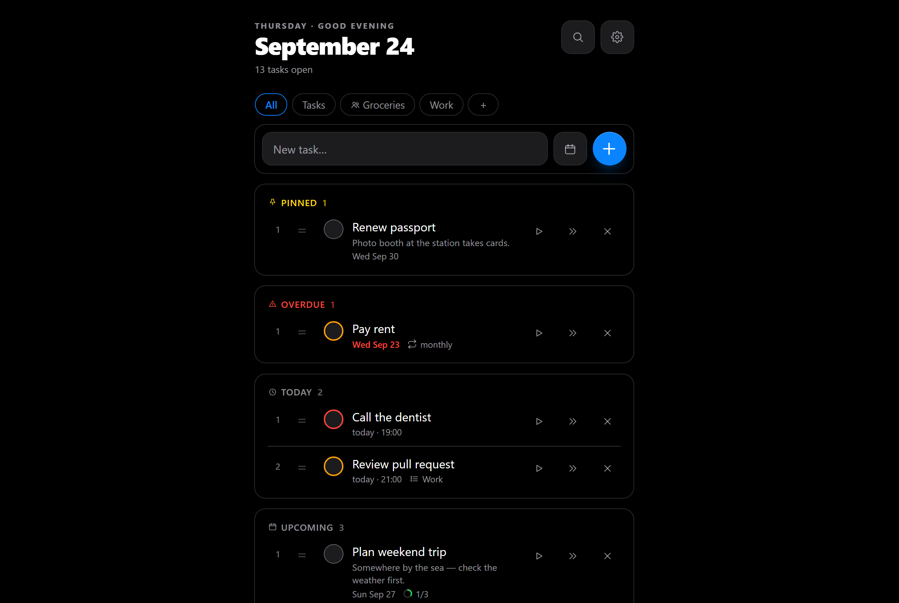
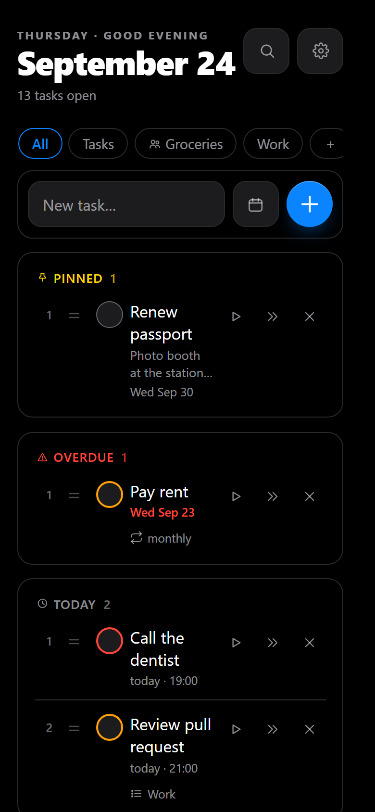
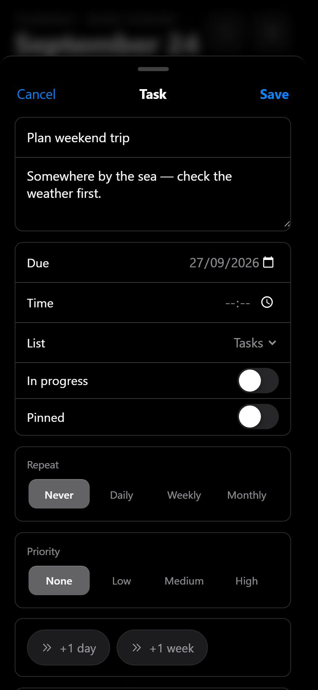
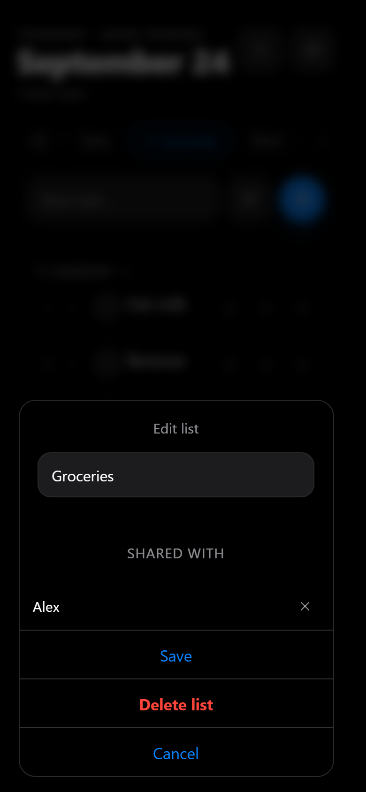
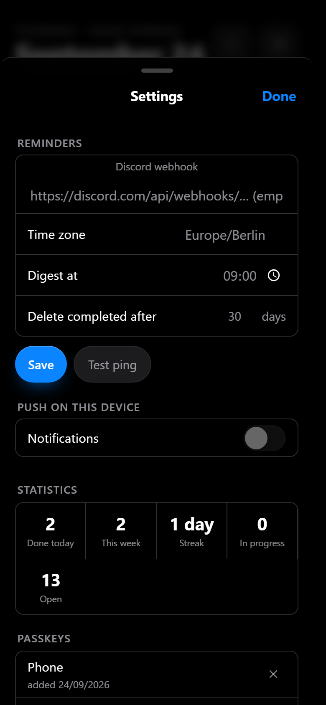

# todo

A deliberately minimal, self-hosted todo app for one person or a small
household/team. Sign-in is **passkey-only**. Reminders arrive via Discord
webhook and/or Web Push. The frontend is an installable PWA in an iOS style,
AMOLED black (dark-only, vanilla HTML/CSS/JS, no build step); the backend is a
single Go binary with SQLite. **Everything is configured in the app** — there
is no app configuration through environment variables.

The UI speaks English and German (automatic by browser language, selectable in
the settings).



## Why minimal

Most todo apps have grown into project-management suites: projects, labels,
filters, boards, integrations, subscriptions. For everyday tasks that is mostly
overhead. todo does three things — write it down, check it off, get
reminded — and tries to do them well.

- **No bloat.** No tags, no boards, no sorting magic. A task has a title and,
  if you want, a date, time, repeat, priority, note, subtasks and a list. That's it.
- **Your data, your server.** No cloud account, no tracking, no subscription.
  One Go binary and one SQLite file — a backup of that file is everything.
- **Low maintenance.** No framework, no build step, no environment
  configuration, passkeys instead of passwords. It is meant to run for years
  without needing attention.

## Screenshots

| Tasks | Edit sheet | Shared list | Settings |
|---|---|---|---|
|  |  |  |  |

## Features

- Create, complete, delete tasks — tap one to **edit** it in a sheet (title,
  note, due date/time, repeat, priority, list, pin)
- **Subtasks** (one level): the parent shows progress (☑ 2/3); completing the
  parent completes open subtasks (after asking); on repeating tasks the
  subtasks start fresh with each occurrence
- **Links** between tasks ("belongs together"), **notes**, **pinning**,
  **search** (titles and notes)
- **Images**: up to 6 photos per task, resized before upload, stored as BLOBs
  in SQLite — one backup contains everything
- **Priority** low/medium/high as a colored ring (deliberately no sorting)
- **Lists**: a chip bar with "All" and your own lists; `#Name` in the quick
  add puts a task straight into a list
- **Accounts**: the admin creates accounts in the settings; everyone gets a
  personal setup code and only sees their own lists and tasks
- **Shared lists**: share a list with other accounts — everyone edits its
  tasks, only the owner manages the list; reminders go to everyone involved
- **Quick add** understands dates, times and repeats in plain language
  ("Buy milk tomorrow 6pm", "Rent in 3 days", "Trash every monday",
  "Rent monthly"; `!1` high … `!3` low priority)
- **Snooze**: ⏭ on a row = +1 day, +1 week in the sheet
- **Reminders**: date + time → ping at that time; date only → morning digest;
  overdue tasks appear in the digest every morning until done. Via Discord
  webhook and/or **Web Push** to the device (Settings → "Push on this
  device"; on iPhone from iOS 16.4 as an installed app) with "Done" and
  "+1 day" buttons
- **Auto-archive**: completed tasks are deleted after N days (0 = never); the
  **stats** (today/week/streak) keep counting in a separate table
- **Backup** export/import of your own data in the app
- Works offline as an app shell; the tasks themselves need a connection (the
  API is never cached, on purpose)

## Running it

```sh
mkdir todo && cd todo
curl -O https://raw.githubusercontent.com/ariazonaa/todo/main/docker-compose.yml
mkdir -p data && sudo chown 10001 data
docker compose up -d
```

Then put it behind a reverse proxy with HTTPS (see below), open it in the
browser and follow the setup. It asks for a **setup code**, which the server
writes to its log and to a file in the data directory; it disappears once the
first passkey exists:

```sh
docker compose logs todo | grep -i setup    # or: cat data/setup-code.txt
```

The server builds nothing: Compose pulls `ghcr.io/ariazonaa/todo:latest`, the
image CI built and scanned. A new `latest` only appears when a commit lands on
`main`.

**Update:**

```sh
sqlite3 data/todo.db ".backup data/todo-before-update.db"   # migrations run on start
docker compose up -d                                         # pulls the newest :latest
```

Because of `pull_policy: always`, **every** `docker compose up -d` pulls the
newest image — make the backup before every `up`.

**Which version is running?**

```sh
docker inspect -f '{{ index .Config.Labels "org.opencontainers.image.revision" }}' todo
```

**Pinning a version:** releases are also published as `:X.Y.Z`, `:X.Y` and
`:X` (e.g. `ghcr.io/ariazonaa/todo:1`). Use one of these instead of `:latest`
if you'd rather update on releases than on every commit — see
[Releases](https://github.com/Ariazonaa/todo/releases).

**Rolling back:** every commit on `main` also has a fixed tag, the first 12
characters of the commit hash; every release has its version tag. Temporarily
replace `:latest` with that tag in `docker-compose.yml` and run
`docker compose up -d`. If the newer image already
migrated the database, restore the backup first (`docker compose stop`,
`cp data/todo-before-update.db data/todo.db`).

### Reverse proxy and passkeys

An nginx example (HTTPS, HTTP/3, HSTS, Host header, upload limits) is in
[`deploy/nginx/todo.example.com.conf`](deploy/nginx/todo.example.com.conf).

- Passkeys (WebAuthn) need **HTTPS** (except on `localhost`).
- The proxy must **pass the Host header through** (Caddy does by default;
  nginx: `proxy_set_header Host $host;`). Passkeys are bound to the domain —
  changing the domain later means registering new ones.
- Don't publish the container port on all interfaces: the app trusts the
  proxy's `X-Real-IP` (the compose file binds to `127.0.0.1`).
- An instance without an admin passkey only accepts the **setup code** from
  its log — knowing the URL isn't enough to take it over. Every restart
  without one creates a new code.
- Passkeys need **user verification** (PIN/biometrics). A security key
  without a PIN won't do — set a PIN first.
- **Adding/removing passkeys** requires a fresh sign-in (at most 10 minutes
  old); otherwise the app asks for an existing passkey first.

### Locked out? (all passkeys lost)

Admin — delete only the admin's passkeys, sessions and push devices:

```sh
docker compose stop
sqlite3 data/todo.db "DELETE FROM push_subscriptions WHERE user_id IN (SELECT id FROM users WHERE is_admin = 1); DELETE FROM sessions WHERE user_id IN (SELECT id FROM users WHERE is_admin = 1); DELETE FROM credentials WHERE user_id IN (SELECT id FROM users WHERE is_admin = 1);"
docker compose start
docker compose logs todo | grep -i setup
```

At `/setup` ("Set up account" on the sign-in page) create a new passkey with
that code — it belongs to the admin account again; tasks, images and settings
stay. Everyone else keeps signing in normally meanwhile.

Another person: the admin removes their passkeys via SQL (as above, with
`user_id = (SELECT id FROM users WHERE name = '…')`) and creates a new setup
code for them under Settings → "Users".

### Environment variables (infrastructure only, all optional)

| Variable | Default | Purpose |
|---|---|---|
| `PORT` | `8080` | HTTP port inside the container |
| `DB_PATH` | `/data/todo.db` (in the image) | path to the SQLite file |
| `INSECURE_COOKIE` | off | `1` only for local development without HTTPS (cookies without `Secure` and without the `__Host-` prefix) |

## Development

```sh
INSECURE_COOKIE=1 go run .     # http://localhost:8080, setup in the browser
go test ./...
go vet ./...
npm ci && npm run test:setup   # once: Playwright + Chromium
npm test                       # browser smoke test (starts the server itself)
docker build -t todo .
```

## Translations

All texts live in `static/locales/<language>.json`. A new language is a copy
of `en.json` plus one entry each in `languages` (`i18n.go`) and
`SUPPORTED`/`LANG_NAMES` (`static/i18n.js`) — `go test` checks that no keys
are missing or unused. The quick-add parser has its own vocabulary per
language (`DATE_VOCAB` in `static/dateparse.js`).

## Deliberate decisions

- **Dark-only:** there is no light mode, on purpose.
- **Subtasks** are one level deep and can't repeat.
- **Monthly repeat:** tasks on the 29th–31st clamp to the 28th in February
  and stay on the 28th afterwards (documented drift, pinned in tests).
- **Due dates** are local wall-clock strings in each person's time zone.
- **Backups of the database file:** WAL mode — don't just copy `todo.db`
  while running; use `sqlite3 data/todo.db "VACUUM INTO 'backup.db'"` or
  stop, copy, start. The database also contains the passkeys.
- **After downtime** missed time pings fire exactly once; the digest only
  covers the current day (overdue tasks are in it anyway).

## Contributing

Issues and pull requests are welcome — bug reports, fixes, translations and
small improvements. The one condition: todo stays minimal. A change should
serve "write it down, check it off, get reminded" without making the app
heavier to use or to run (see [Why minimal](#why-minimal)).

Usually out of scope: tags, boards, projects, third-party integrations beyond
reminders, a frontend framework or build step, configuration through
environment variables, heavy dependencies.

For anything bigger than a fix, please open an issue first so we can talk
about whether it fits. Pull requests should keep `gofmt`, `go vet`, `go test`
and `npm test` green; texts go into `static/locales/*.json` in both English
and German.

## License

[MIT](LICENSE)
